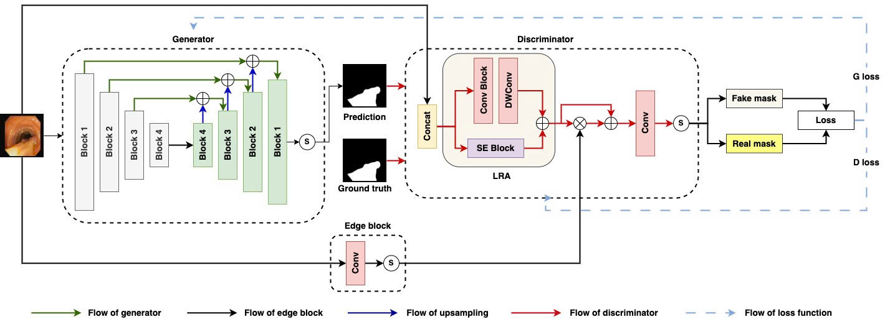

# An Efficient Boundary-Aware Adversarial Model for Polyp Segmentation in Colonoscopy Images

This repository contains the official implementation of **E-LRA**, a lightweight GAN-based framework for polyp segmentation in colonoscopy images. E-LRA achieves state-of-the-art performance with only **1.07 million parameters**, making it highly suitable for real-time clinical applications.

## Table of Contents
1. [Abstract](#abstract)
2. [Installation](#installation)
3. [Usage](#usage)
4. [Datasets](#datasets)
5. [Results](#results)
6. [Citation](#citation)
7. [License](#license)
8. [Contact](#contact)

## Abstract
Accurate and efficient segmentation of colorectal polyps from colonoscopic images is essential for early cancer detection and clinical decision-making. This study presents a compact adversarial segmentation framework that integrates edge-guided attention with a refinement-aware discriminator, aiming to improve boundary localization under constrained computational resources. Despite its lightweight architecture, the proposed model consistently surpasses both transformer-based and mobile-efficient baselines across five public datasets. Notably, it achieves state-of-the-art performance on the Kvasir dataset, while maintaining competitive accuracy in challenging cross-domain scenarios where existing large-scale models often experience generalization degradation. Extensive ablation studies validate the contribution of each architectural component, and inference-time analysis reveals tightly bounded latency variation (about 8.5\%), suggesting its potential for deployment in real-time clinical workflows. These results indicate that well-designed adversarial learning can effectively balance accuracy, robustness, and efficiency in biomedical image segmentation.

## Installation
### Prerequisites
- Python 3.8+
- PyTorch 1.9.0 or higher
- NVIDIA GPU (recommended for training)
- CUDA 11.6 or higher

### Steps
1. Clone this repository:
   ```bash
   git clone https://github.com/TongDuyDat/lgps_pytorch.git
   cd lgps_pytorch
   ```
2. Install dependencies:
   ```bash
   pip install -r requirements.txt
   ```
   Note: Ensure `requirements.txt` includes dependencies like `torch`, `torchvision`, `numpy`, `opencv-python`, `albumentations`, and `scikit-image`. Refer to the file for the complete list.

3. Verify installation:
   ```bash
   python -c "import torch; print(torch.__version__)"
   ```

## Usage
### Setting Up Dataset File Paths
The `data_config.py` file in the `data/configs/` directory specifies the dataset path for training and evaluation. Below is an example configuration for the **CVC-300** dataset:

```python
DATASET_SOURCE = "data/data_benchmarks/CVC-300"
```

#### Instructions for Setting Up File Paths
- **DATASET_SOURCE**: Defines the path to the dataset directory (e.g., `"data/data_benchmarks/CVC-300"`). Update this to point to the desired dataset, such as `Kvasir-SEG`, `CVC-ClinicDB`, `ETIS`, or `PolypGen`.
- **Example Update**: To use the Kvasir-SEG dataset, modify the `DATASET_SOURCE` in `data/configs/train_config.py`:
  ```python
  DATASET_SOURCE = "data/data_benchmarks/Kvasir-SEG"
  ```
- **Directory Structure**: Ensure the dataset is organized in the `data/` directory with subfolders for images and masks:
  ```
  datasets/
    ├── images/
    │   ├── image1.jpg
    │   ├── image2.jpg
    │   └── ...
    └── masks/
        ├── mask1.png
        ├── mask2.png
        └── ...
```
- **Saving Changes**: After updating the `DATASET_SOURCE`, save the `data/configs/train_config.py` file before running the training or evaluation scripts.

### Training
Train the model using the provided configuration:
```bash
python train.py --config "configs/train_config.py" --batch-size 16
```
- The `train_config.py` file contains hyperparameters (e.g., learning rate, epochs). Modify it as needed.
- Training logs and checkpoints will be saved in the `outputs/` directory.

### Evaluation
Evaluate the model using a pretrained checkpoint:
```bash
python benchmark.py --data_path "data/CVC-ClinicDB" --checkpoint "path/to/pretrained_model.pth"
```
- Download the pretrained model from [this link](https://example.com/pretrained_model) (replace with the actual URL from the repository).
- Metrics (Dice, IoU) will be reported for the specified dataset.

## Datasets
E-LRA has been validated on the following benchmark datasets:
- **Kvasir-SEG**: [Download](https://datasets.simula.no/kvasir-seg/)
- **CVC-ClinicDB**: [Download](https://polyp.grand-challenge.org/CVCClinicDB/)
- **ETIS**: [Download](https://polyp.grand-challenge.org/ETISLarib/)
- **CVC-300**: [Download](http://pages.cvc.uab.es/CVC-Colon/)
- **PolypGen**: [Download](https://drive.google.com/drive/folders/16uL9n84SrMt7IiQFzTUQNaJ9TbHJ8DhW)

## Citation
If you use E-LRA in your research, please cite our paper:
```bibtex
@article{,
  title={An Efficient Boundary-Aware Adversarial Model for Polyp Segmentation in Colonoscopy Images},
  author={},
  journal={},
  year={}
}
```

## License
This project is licensed under the MIT License. See the [LICENSE](LICENSE) file for details.

## Contact
For questions or collaboration, please contact:
- **Author**: Duy Dat Tong
- **GitHub**: [TongDuyDat](https://github.com/TongDuyDat)
- **Email**: dattongduy1.0@gmail.com